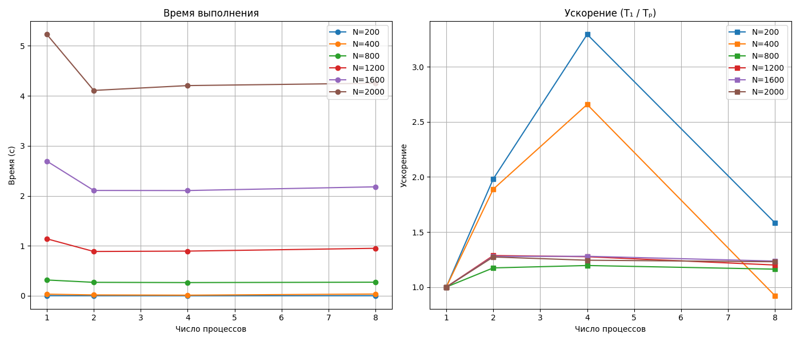

# Лабораторная работа №3: Параллельное умножение матриц с использованием MPI

## Цель
Модифицировать программу последовательного умножения матриц для параллельной работы по технологии MPI. Провести эксперименты с различными размерами матриц и количеством вычислительных ядер, оценить ускорение и эффективность.

## Структура проекта
- `generate_matrices.py` – генерация случайных матриц A и B.
- `matrix_multiply_mpi.cpp` – параллельная MPI-реализация умножения матриц (распределение строк).
- `verify_result.py` – верификация результатов через NumPy.
- `run_mpi_experiments.py` – автоматизация компиляции, запуска тестов и визуализации.
- `data/` – входные и выходные матрицы.
- `mpi_performance.csv` – сводная таблица результатов.
- `mpi_performance.png` – графики времени и ускорения.

## Требования
- Компилятор MPI (`mpicxx`), реализация OpenMPI.
- Python 3.8+ с библиотеками `numpy`, `matplotlib`.
- ОС Linux (Fedora 38 в эксперименте).

## Сборка и запуск

### Установка зависимостей (Fedora)
```bash
sudo dnf install openmpi openmpi-devel
pip install numpy matplotlib
```

### Полный эксперимент
```bash
python run_mpi_experiments.py
```
Скрипт автоматически:
- найдёт компилятор и `mpirun`,
- скомпилирует MPI-программу,
- выполнит тесты для размеров `[200, 400, 800, 1200, 1600, 2000]` и числа процессов `[1, 2, 4, 8]`,
- проверит каждый результат,
- построит графики времени и ускорения.

### Ручной запуск отдельного теста
```bash
python generate_matrices.py 1000
mpicxx -O2 matrix_multiply_mpi.cpp -o matrix_multiply_mpi
mpirun --oversubscribe -np 4 ./matrix_multiply_mpi 1000
python verify_result.py 1000
```

## Характеристики стенда
- **Процессор:** AMD Ryzen 5 3550H (4 физических ядра, 8 логических потоков SMT, 2.1 ГГц)
- **Кэш:** L1d 128 КБ, L2 2 МБ, L3 4 МБ
- **ОС:** Fedora 38, x86_64
- **MPI:** OpenMPI 4.1.4
- **Флаги компиляции:** `-O2`

## Результаты экспериментов

### Таблица времени выполнения (в секундах)

| Размер | P=1    | P=2    | P=4    | P=8    |
|:------:|:------:|:------:|:------:|:------:|
| 200    | 0.0039 | 0.0019 | 0.0012 | 0.0024 |
| 400    | 0.0321 | 0.0170 | 0.0121 | 0.0348 |
| 800    | 0.3158 | 0.2690 | 0.2641 | 0.2716 |
| 1200   | 1.1399 | 0.8863 | 0.8937 | 0.9498 |
| 1600   | 2.6937 | 2.1069 | 2.1053 | 2.1795 |
| 2000   | 5.2297 | 4.1081 | 4.2048 | 4.2522 |

### Таблица GFLOPS

| Размер | P=1  | P=2  | P=4   | P=8  |
|:------:|:----:|:----:|:-----:|:----:|
| 200    | 4.14 | 8.21 | 13.65 | 6.56 |
| 400    | 3.99 | 7.53 | 10.60 | 3.67 |
| 800    | 3.24 | 3.81 | 3.88  | 3.77 |
| 1200   | 3.03 | 3.90 | 3.87  | 3.64 |
| 1600   | 3.04 | 3.89 | 3.89  | 3.76 |
| 2000   | 3.06 | 3.89 | 3.81  | 3.76 |



## Верификация
Для всех тестов (размер × число процессов) результат, полученный MPI-программой, совпадает с эталонным умножением NumPy (относительная погрешность < 1e-10).

## Анализ и выводы

### Время выполнения
- Для **малых матриц (N=200, 400)** время при P=8 даже **возрастает** по сравнению с P=4. Это объясняется доминированием накладных расходов на коммуникации (Scatterv / Gatherv) над полезной вычислительной работой.
- Для **средних и больших матриц (N≥800)** время практически не уменьшается при увеличении числа процессов с 2 до 4 и до 8. Основная причина — ограниченная пропускная способность памяти и кэша: три матрицы размера 800×800 уже занимают ~15 МБ, что превышает L3-кэш (4 МБ), а при 4 и 8 процессах потоки конкурируют за общий контроллер памяти.

### Ускорение
- Ускорение наблюдается только при переходе от P=1 к P=2 (примерно в 1.3–1.6 раза для больших N).
- При P=4 и P=8 ускорение остаётся на том же уровне или даже снижается, то есть **рост производительности отсутствует**.
- Процессор имеет 4 физических ядра с технологией SMT (8 логических потоков). Однако задача умножения матриц является вычислительно-интенсивной и практически не выигрывает от SMT (Hyper-Threading), так как оба логических потока на одном ядре делят функциональные устройства FPU. Поэтому P=8 не даёт прироста относительно P=4.

### Выводы
1. Параллельная MPI-реализация корректно распределяет строки матрицы A и собирает результат, что подтверждено верификацией.
2. Для малых размеров (N≤400) использование более 2–4 процессов **неэффективно** из-за высоких накладных расходов на пересылку данных.
3. На данной архитектуре (4 физических ядра) максимальное ускорение достигается при **P=2** и составляет около 1.6x для больших матриц. Дальнейшее увеличение числа процессов нецелесообразно.
4. Для повышения производительности на одном узле следует использовать гибридное распараллеливание (MPI + OpenMP) или перейти к блочным алгоритмам умножения матриц с лучшей локальностью данных.
