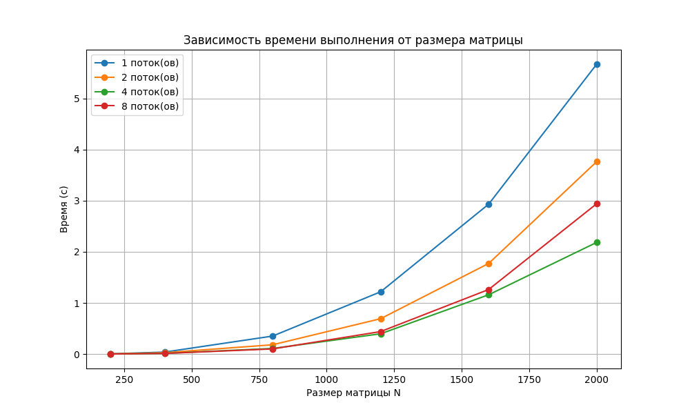
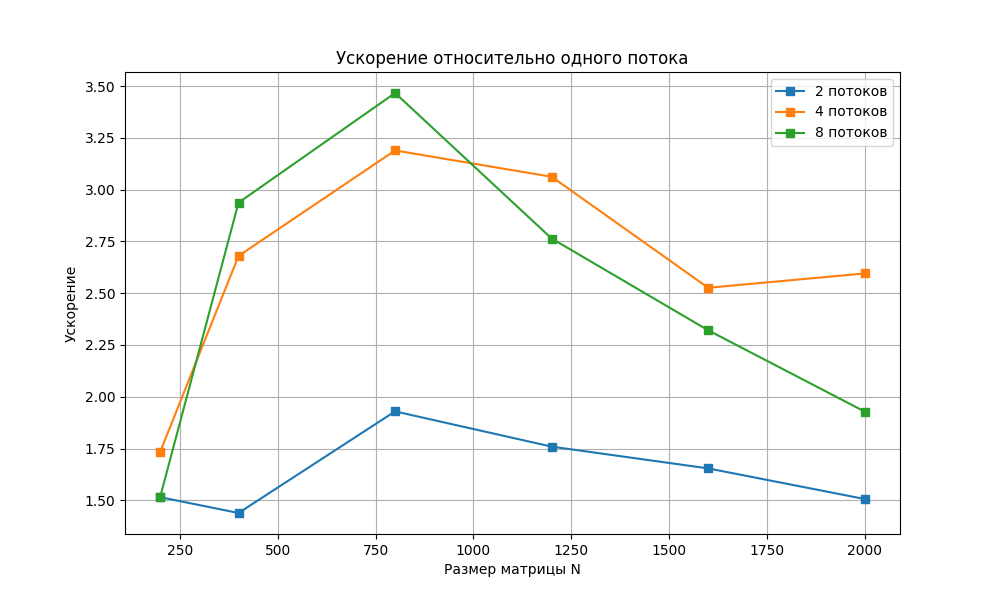
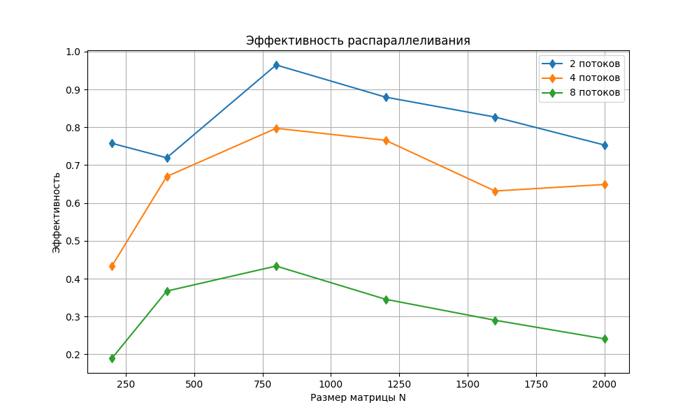

# Лабораторная работа №2: Параллельное умножение матриц (OpenMP)

## Цель
Модификация последовательного алгоритма умножения матриц из ЛР №1 для параллельной работы с использованием технологии OpenMP.
Исследование масштабируемости: зависимость времени, ускорения и эффективности от числа потоков и размера матриц.

## Структура репозитория
- `generate_matrices.py` – генерация матриц (без изменений из ЛР №1)
- `verify_result.py` – проверка результата через NumPy (без изменений из ЛР №1)
- `matrix_multiply_omp.cpp` – параллельное умножение с OpenMP (ЛР №2)
- `run_experiments_omp.py` – автоматический эксперимент с переменным числом потоков (ЛР №2)
- `data/` – рабочие файлы матриц (создаётся автоматически)
- `performance_omp_results.csv` – таблица с временами (ЛР №2)
- `time_vs_size.png`, `speedup.png`, `efficiency.png` – графики (ЛР №2)

## Требования
- Компилятор `g++` с поддержкой OpenMP (`-fopenmp`)
- Python 3.8+, `numpy`, `matplotlib`

## Сборка и запуск

### Установка зависимостей
```bash
pip install numpy matplotlib
```

### Полный эксперимент (ЛР №2)
```bash
python run_experiments_omp.py
```

Скрипт автоматически:
- компилирует `matrix_multiply_omp.cpp` с флагом `-O2 -fopenmp`,
- проводит эксперименты для размеров `[200, 400, 800, 1200, 1600, 2000]` и числа потоков `[1, 2, 4, 8]`,
- проверяет корректность каждого вычисления,
- сохраняет таблицу `performance_omp_results.csv`,
- строит три графика: `time_vs_size.png`, `speedup.png`, `efficiency.png`.

### Ручной запуск одного теста
```bash
python generate_matrices.py 1000
g++ -O2 -fopenmp matrix_multiply_omp.cpp -o matrix_multiply_omp
./matrix_multiply_omp 1000 4
python verify_result.py 1000
```

## Характеристики тестовой машины
- **Процессор:** AMD Ryzen 5 3550H (4 физических ядра, 8 логических потоков, базовая частота 2.1 ГГц)
- **Кэш L3:** 4 МБ
- **ОС:** Linux x86_64
- **Компилятор:** g++ (GCC) 11.4.0, флаги `-O2 -fopenmp`

## Результаты

### Таблица времени выполнения (в секундах)

| Размер (N) | 1 поток | 2 потока | 4 потока | 8 потоков |
|:----------:|:-------:|:--------:|:--------:|:---------:|
| 200        | 0.0053  | 0.0035   | 0.0031   | 0.0035    |
| 400        | 0.0399  | 0.0277   | 0.0149   | 0.0136    |
| 800        | 0.3530  | 0.1830   | 0.1107   | 0.1018    |
| 1200       | 1.2187  | 0.6927   | 0.3980   | 0.4409    |
| 1600       | 2.9323  | 1.7729   | 1.1608   | 1.2635    |
| 2000       | 5.6693  | 3.7641   | 2.1844   | 2.9403    |

*Минимальное время из трёх запусков.*

### Графики




## Верификация
Для каждого размера и каждого числа потоков результат умножения, полученный параллельной C++ программой, совпадает с эталонным вычислением NumPy (относительная погрешность < 1e-10).

## Выводы
- **Масштабируемость по размеру.** На всех конфигурациях потоков время выполнения подчиняется кубической зависимости O(N³).
- **Ускорение на физических ядрах.** Для матриц среднего и большого размера (N ≥ 800) при переходе от 1 к 4 потокам достигается ускорение ~2.5–2.7×, что близко к теоретическому пределу с учётом накладных расходов на синхронизацию и доступа к памяти.
- **Эффект гиперпоточности (8 потоков).** Дополнительные логические ядра (SMT) дают незначительный прирост или даже замедление:
  - На малых N (200, 400) время практически не уменьшается.
  - На N = 1200, 1600, 2000 наблюдается **замедление по сравнению с 4 потоками** (например, 2.18 с → 2.94 с для N=2000). Это объясняется тем, что задача умножения матриц интенсивно использует подсистему памяти и кэш, а два потока на одном физическом ядре начинают конкурировать за исполнительные устройства и пропускную способность кэша, что снижает общую производительность.
- **Эффективность.** При увеличении числа потоков эффективность закономерно падает: для 4 потоков она составляет ~65–70%, для 8 потоков — менее 40%. Это типично для задач, ограниченных пропускной способностью памяти (memory-bound).
- **Практическая рекомендация.** Для данной архитектуры и задачи оптимальным является использование 4 потоков — по числу физических ядер. Дальнейшее наращивание числа потоков через SMT нецелесообразно и может ухудшить время выполнения.

Таким образом, технология OpenMP позволила легко и с минимальными изменениями кода получить значительный выигрыш в производительности, однако эффективность распараллеливания сдерживается архитектурными ограничениями процессора.
