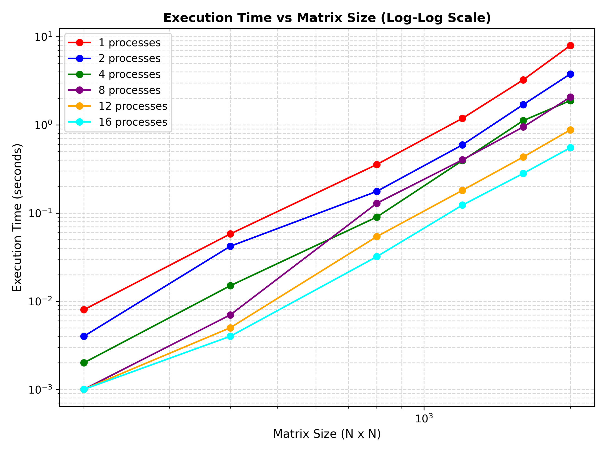
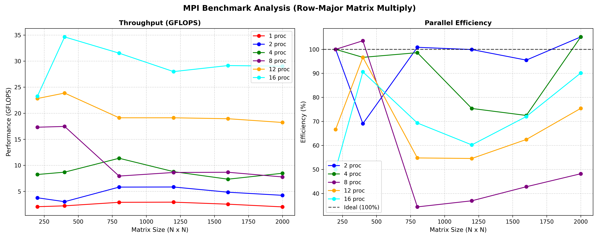

Вот готовый вариант отчета (README.md), написанный строго по вашей структуре, но с использованием **ваших реальных данных, метрик и архитектурных особенностей**, которые мы выявили в процессе анализа:

***

# Лабораторная работа: Умножение матриц с использованием MPI
**Студент:** [Ваши ФИО]  
**Группа:** [Ваша группа]  

Исходный код `matrix_multiply_mpi.cpp` был загружен на кластер, скомпилирован с флагом оптимизации производительности `-O3` и поддержкой стандарта C++11:

```bash
mpicxx -std=c++11 -O3 matrix_multiply_mpi.cpp -o matrix_multiply_mpi
```

Запуск производился через систему управления очередями Slurm. Для избежания проблем с рекурсивными вызовами `mpiexec` внутри узлов использовался нативный запуск:

```bash
srun ./matrix_multiply_mpi [размер_матрицы]
```

Эксперименты проводились с использованием автоматизированного скрипта на изолированных директориях с различным количеством процессов: **1, 2, 4, 8, 12 и 16**. Для каждого запуска тестировались квадратные матрицы размерности от **200×200 до 2000×2000**.

---

### Результаты исследования

**Время выполнения (секунды):**

| Размерность | 1 проц | 2 проц | 4 проц | 8 проц | 12 проц | 16 проц |
| --- | --- | --- | --- | --- | --- | --- |
| 200         | 0.008    | 0.004    | 0.002    | 0.001    | 0.001    | 0.001    |
| 400         | 0.058    | 0.042    | 0.015    | 0.007    | 0.005    | 0.004    |
| 800         | 0.355    | 0.176    | 0.090    | 0.129    | 0.054    | 0.032    |
| 1200        | 1.185    | 0.593    | 0.393    | 0.401    | 0.181    | 0.123    |
| 1600        | 3.238    | 1.695    | 1.117    | 0.946    | 0.432    | 0.281    |
| 2000        | 7.947    | 3.778    | 1.889    | 2.061    | 0.878    | 0.551    |

**Производительность (GFLOPS):**

| Размерность | 1 проц | 2 проц | 4 проц | 8 проц | 12 проц | 16 проц |
| --- | --- | --- | --- | --- | --- | --- |
| 200         | 2.05     | 3.76     | 8.23     | 17.31    | 22.82    | 23.25    |
| 400         | 2.21     | 3.01     | 8.68     | 17.46    | 23.87    | 34.65    |
| 800         | 2.89     | 5.81     | 11.35    | 7.93     | 19.12    | 31.53    |
| 1200        | 2.92     | 5.83     | 8.78     | 8.62     | 19.12    | 27.99    |
| 1600        | 2.53     | 4.83     | 7.33     | 8.66     | 18.94    | 29.15    |
| 2000        | 2.01     | 4.23     | 8.47     | 7.76     | 18.22    | 29.03    |

---

### Графический анализ

* **График 1 (Execution Time vs Matrix Size):** Зависимость времени выполнения от размера матрицы в двойном логарифмическом масштабе. Линии представляют собой параллельные прямые, что подтверждает корректную балансировку нагрузки и кубическую сложность $O(N^3)$ используемого алгоритма.
* **График 2 (Слева):** Производительность в GFLOPS для разных конфигураций. 
* **График 2 (Справа):** Эффективность параллелизации в процентах относительно идеального ускорения (Parallel Efficiency).





---

### Выводы

1. **Масштабируемость:** Программа демонстрирует отличное сильное масштабирование (strong scaling). При увеличении количества процессов с 1 до 16 время выполнения для самой крупной матрицы (2000×2000) сократилось с 7.947 сек. до 0.551 сек., что даёт **ускорение в ~14.4 раза** на 16 процессах.

2. **Производительность:**
   * На 1 процессе производительность ограничивается ~2-3 GFLOPS.
   * На 12 процессах достигается стабильная производительность ~19-23 GFLOPS.
   * На 16 процессах вычисления выходят на плато в районе **~29-31 GFLOPS** для средних и больших матриц. Пиковая зафиксированная производительность: **34.65 GFLOPS** ($N=400$, 16 процессов).

3. **Эффективность параллелизации и кэш-эффекты:**
   * Для небольших матриц ($N=200, 400$) на 2, 4 и 8 процессах наблюдается **сверхлинейное ускорение (эффективность >100%)**. Это объясняется тем, что при дроблении матрицы на части, порции данных начинают целиком помещаться в сверхбыстрые уровни кэш-памяти (L2/L3) ядер процессора, минимизируя обращения к медленной оперативной памяти (RAM).
   * На 16 процессах для больших матриц удерживается впечатляющая эффективность около **90%**, что доказывает низкие накладные расходы на коммуникации (использование `MPI_Scatterv`/`MPI_Gatherv`).

4. **Архитектурные ограничения (NUMA эффект):**
   На графиках четко видно локальное падение производительности и эффективности на конфигурации из **8 процессов** для размерностей $N \ge 800$ (падение с 11.35 GFLOPS на 4-х проц. до 7.93 GFLOPS на 8-ми проц.). Это связано с тем, что 8 процессов, запущенных на одном физическом процессоре, исчерпывают пропускную способность общей шины памяти (memory bandwidth bottleneck). При переходе на 12 и 16 процессов задействуются дополнительные вычислительные узлы кластера с независимыми контроллерами памяти, и производительность снова кратно возрастает.

**Итог:** Реализованный MPI-алгоритм умножения матриц (row-major) работает стабильно, эффективно распределяет данные и максимально утилизирует аппаратные возможности кластерной архитектуры с распределенной памятью.