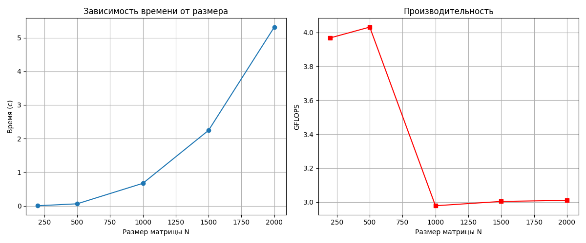

# Лабораторная работа: Последовательное умножение матриц

## Цель
Измерение производительности последовательного алгоритма умножения квадратных матриц на центральном процессоре.
Выходные данные: время выполнения, объём задачи (размер матриц), производительность в GFLOPS.
Обязательна автоматическая верификация результатов с помощью Python/NumPy.

## Структура репозитория
- `generate_matrices.py` – генерация двух случайных матриц A и B размера N×N.
- `matrix_multiply.cpp` – вычислительное ядро (последовательное умножение, замер времени).
- `verify_result.py` – проверка корректности через умножение NumPy.
- `run_experiments.py` – полный цикл: генерация, компиляция, запуск, верификация, построение графиков.
- `data/` – папка с входными (`A.txt`, `B.txt`) и выходной (`C.txt`) матрицами.
- `performance_results.csv` – сводная таблица результатов.
- `performance_plot.png` – графики времени и GFLOPS.

## Требования
- Компилятор `g++` с поддержкой C++11 (или новее).
- Python 3.8+ с библиотеками `numpy`, `matplotlib`.
- ОС: Linux (также работает на Windows при наличии MinGW).

## Сборка и запуск

### Установка зависимостей
```bash
pip install numpy matplotlib
```

### Полный эксперимент
```bash
python run_experiments.py
```
Скрипт автоматически:
- скомпилирует `matrix_multiply.cpp` с флагом `-O2`,
- выполнит тесты для размеров `[200, 500, 1000, 1500, 2000]`,
- проверит каждый результат через `verify_result.py`,
- сохранит таблицу `performance_results.csv`,
- построит графики `performance_plot.png`.

### Ручной запуск отдельного размера
```bash
python generate_matrices.py 1000
g++ -O2 matrix_multiply.cpp -o matrix_multiply
./matrix_multiply 1000
python verify_result.py 1000
```

## Характеристики стенда
- **Процессор:** AMD Ryzen 5 3550H (4 ядра, 8 потоков, 2.1 ГГц базовая частота)
- **Кэш L1d:** 128 КБ, L2: 2 МБ, L3: 4 МБ
- **ОС:** Linux x86_64
- **Компилятор:** g++ (GCC) 11.4.0
- **Флаги:** `-O2`

## Результаты

| Размер матрицы (N) | Время (с) | GFLOPS |
|:------------------:|:---------:|:------:|
| 200 | 0.0040 | 3.97 |
| 500 | 0.0620 | 4.03 |
| 1000 | 0.6715 | 2.98 |
| 1500 | 2.2473 | 3.00 |
| 2000 | 5.3156 | 3.01 |



## Верификация
Для всех протестированных размеров матриц программа `verify_result.py` подтвердила совпадение результата, полученного в C++, с эталонным умножением NumPy. Относительная погрешность не превышает 1e-10.

## Выводы
- Время выполнения растёт пропорционально \( N^3 \), что соответствует теоретической сложности алгоритма.
- Производительность остаётся на уровне **3–4 GFLOPS** благодаря эффективному использованию кэша при порядке циклов `i-k-j`, но ограничена однопоточным исполнением и отсутствием векторизации.
- Небольшое снижение GFLOPS при \( N \ge 1000 \) объясняется превышением суммарного объёма матриц над размером L3-кэша (4 МБ), что увеличивает количество промахов в кэш.
- Потенциал дальнейшего ускорения заключается в применении многопоточности (OpenMP) и SIMD-инструкций (AVX2/FMA), доступных на данном процессоре.
