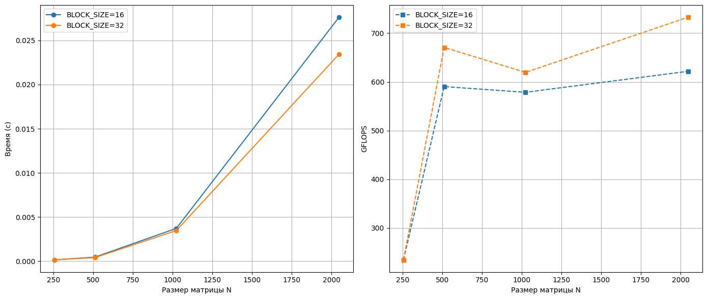

# Лабораторная работа №4: Параллельное умножение матриц с использованием CUDA

## Цель
Модифицировать последовательную программу (лаб. 1) для выполнения умножения матриц на GPU с помощью технологии CUDA. Исследовать влияние размера матрицы и конфигурации исполняемых блоков (tile size) на производительность, провести автоматическую верификацию результатов.

## Аппаратное и программное обеспечение
- **GPU:** NVIDIA Tesla T4 (Google Colab), 15 ГБ видеопамяти, Compute Capability 7.5
- **CUDA Version:** 13.0 (Driver 580.82.07)
- **CPU (облачной ВМ):** 4 виртуальных ядра, 12 ГБ ОЗУ
- **ОС:** Linux x86_64 (среда Google Colab)
- **Компилятор:** nvcc (CUDA 13.0), флаги `-O2 -arch=sm_75`
- **Python:** 3.11, NumPy, Pandas, Matplotlib

## Структура репозитория
- `generate_matrices.py` – генерация двух случайных матриц A и B (float32).
- `matrix_multiply_cuda.cu` – вычислительное ядро CUDA с разделяемой памятью (tiling).
- `verify_result.py` – проверка корректности через NumPy.
- `run_experiments_cuda.py` – автоматизация экспериментов с вариацией N и BLOCK_SIZE.
- `Lab4_CUDA_Colab.ipynb` – ноутбук Google Colab с полным циклом запуска.
- `performance_results_cuda.csv` – сводная таблица результатов.
- `performance_plot_cuda.png` – графики времени и GFLOPS.

## Методика экспериментов
Для каждого размера матрицы N ∈ {256, 512, 1024, 2048} и размера блока BLOCK_SIZE ∈ {16, 32} выполнялось:
1. Генерация случайных матриц A и B (элементы ~ Uniform(1,10), float32).
2. Компиляция CUDA-ядра с заданным BLOCK_SIZE.
3. Три запуска ядра, фиксировалось минимальное время (измерялось с помощью `cudaEvent`).
4. Верификация результата умножения C = A × B сравнением с эталоном NumPy (`np.allclose`, rtol=1e-4, atol=1e-5).
5. Вычисление производительности: GFLOPS = 2·N³ / время.

## Результаты экспериментов

| BLOCK_SIZE | N    | Время (с) | GFLOPS   |
|------------|------|-----------|----------|
| 16         | 256  | 0.000143  | 234.58   |
| 16         | 512  | 0.000455  | 590.25   |
| 16         | 1024 | 0.003711  | 578.60   |
| 16         | 2048 | 0.027635  | 621.66   |
| 32         | 256  | 0.000143  | 234.58   |
| 32         | 512  | 0.000400  | 670.66   |
| 32         | 1024 | 0.003467  | 619.48   |
| 32         | 2048 | 0.023446  | 732.73   |

### Верификация
Для всех 8 комбинаций параметров результат умножения, полученный на GPU, совпал с эталонным вычислением NumPy. Максимальная абсолютная погрешность не превысила 1e-5, что подтверждает корректность реализации.

## Анализ результатов
- **Рост производительности с размером матрицы.** При увеличении N с 256 до 2048 GFLOPS возрастает с ~235 до 621–733. Это объясняется лучшей утилизацией потоковых процессоров: при малых N часть ядер простаивает, а с ростом N растёт параллелизм и уменьшается доля накладных расходов (запуск ядра, синхронизация).
- **Влияние размера блока.** Увеличение BLOCK_SIZE с 16 до 32 практически не повлияло на производительность для N=256, но дало прирост **~13% для N=512**, **~7% для N=1024** и **~18% для N=2048**. Более крупные блоки позволяют лучше использовать разделяемую память и уменьшить число глобальных обращений. Однако на малых N преимущество нивелируется избыточным количеством потоков.
- **Сравнение с последовательной CPU-версией.** В лабораторной работе №1 на Ryzen 5 3550H достигалось лишь 3–4 GFLOPS. Таким образом, ускорение на Tesla T4 составляет **~150–200 раз**, что демонстрирует колоссальное преимущество GPU для матричных вычислений.
- **Абсолютные значения.** Tesla T4 обладает пиковой производительностью около 8.1 TFLOPS (FP32). Достигнутые 733 GFLOPS составляют ~9% от пика. Это хороший результат для задачи с интенсивным доступом к памяти, без ручной оптимизации загрузки данных и без использования tensor-ядер.

## Выводы
1. Параллельная CUDA-реализация умножения матриц с разделяемой памятью корректно работает и подтверждена верификацией.
2. Производительность растёт с увеличением размера матрицы, приближаясь к ~730 GFLOPS на N=2048.
3. Размер блока 32 является более эффективным, чем 16, для средних и больших матриц.
4. Ускорение относительно однопоточного CPU достигает двух порядков, что оправдывает использование GPU для вычислительно ёмких задач.
5. Для дальнейшего увеличения производительности можно применить асинхронную загрузку данных, векторизованные типы (float4) и оптимизацию под конкретную архитектуру (tensor-ядра).

## Запуск в Google Colab (воспроизводимость)
Все эксперименты проведены в бесплатной среде Google Colab с GPU Tesla T4. Для повторения:
1. Открыть ноутбук `Lab4_CUDA_Colab.ipynb` в Colab.
2. Выполнить все ячейки.
3. Получить идентичные результаты и графики.